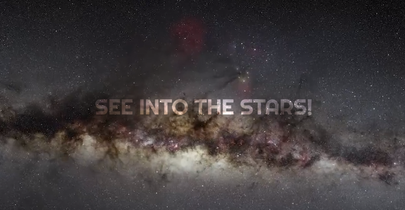
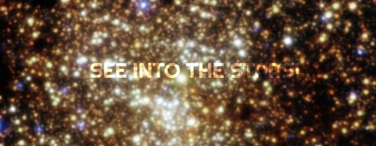
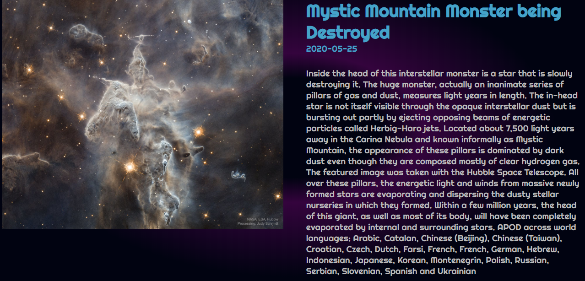

# NASA_APOD

Projeto para API da NASA APOD(Astronomy Picture of the Day). 
Diariamente as imagens são atualizadas com informações interessantes a seu respeito. 

OBS: a página inicial tem um vídeo de fundo, por isso postei duas imagens da Home para ver como o visual vai se transformando.

Conhecimentos aplicados: ReactJS, React Hooks, React Player, HTML5 e CSS3.
